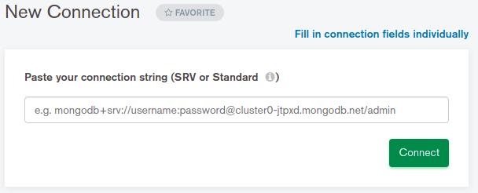
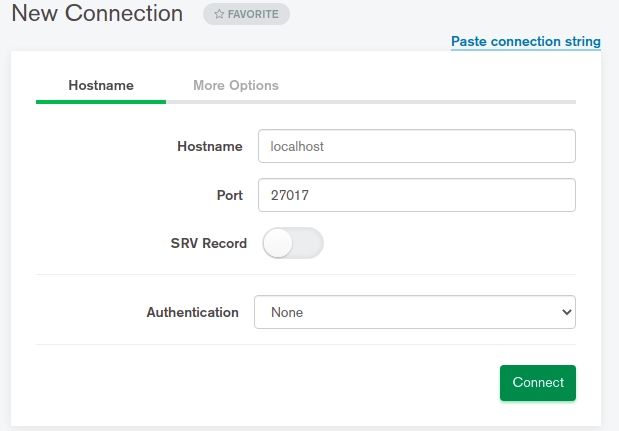
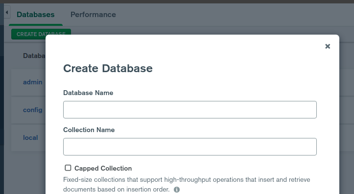
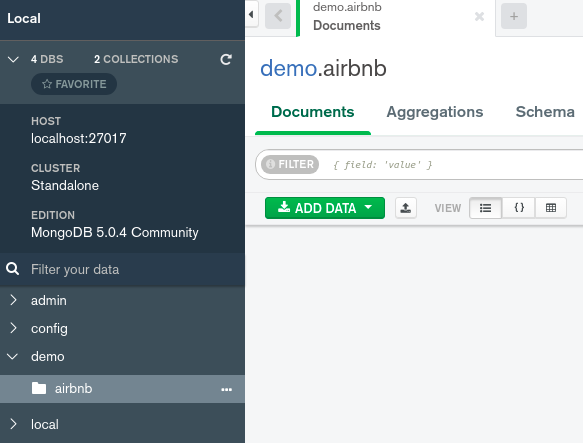
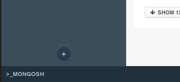

# Instructions for the database 

## Setup
- Install [Compass](https://docs.mongodb.com/compass/master/install/)
- Install [MongoDB](https://docs.mongodb.com/manual/administration/install-community/)

## Prepare
- Download from https://github.com/neelabalan/mongodb-sample-dataset/blob/main/sample_airbnb/listingsAndReviews.json
- Start MongoDB
- Start Compass and connect to `localhost` 
-  Click `fill in ..` 
-   Click `connect`
- 
- I will use: 
  - database: `demo`
  - collection: `airbnb`
- 
- Click `add data`, `import file` and choose `json` and enter path to the previous downloaded `json` file

> [Guide to sample data](https://docs.atlas.mongodb.com/sample-data/sample-airbnb/)

## queries
>to use `MONGOSH` (shell in compass)
>

>```javascript
>use <database_name> (demo)
>```

- [Compass Guide for queries](https://docs.mongodb.com/compass/current/query/filter/)
- Show feature for [search history](https://docs.mongodb.com/compass/master/query/queries/)
- [Explain results](https://docs.mongodb.com/manual/reference/explain-results/)

### single field index
> [Docs](https://docs.mongodb.com/manual/core/index-single/)

```javascript
db.airbnb.find({_id: "10006546"}) //IDHACK
db.airbnb.find({_id: "10006546"}, {description: 1}) //COLLSCAN
```


### multiple fields (compound index)
> [Docs](https://docs.mongodb.com/manual/core/index-compound/)

```javascript
db.airbnb.find({property_type : "House", bedrooms : {$gt : 3}})
db.airbnb.find({property_type : "House", bedrooms : {$gt : 3}, cancellation_policy : {$in : ["moderate", "flexible"]}}, {description : 1})
```

### covered query
> [Docs](https://docs.mongodb.com/manual/core/query-optimization/#std-label-read-operations-covered-query)

### wildcard index
> [Docs](https://docs.mongodb.com/manual/core/index-wildcard/) 
- query against fields whose names cannot be known in advance
- only single field
> [Create Wildcard Index in compass](https://docs.mongodb.com/compass/master/indexes/#std-label-compass-wildcard-index)

- create on amenities 
- query TV
- query TV and Washer
- add new field to amenities (Beer)
- query for it (with explain)
