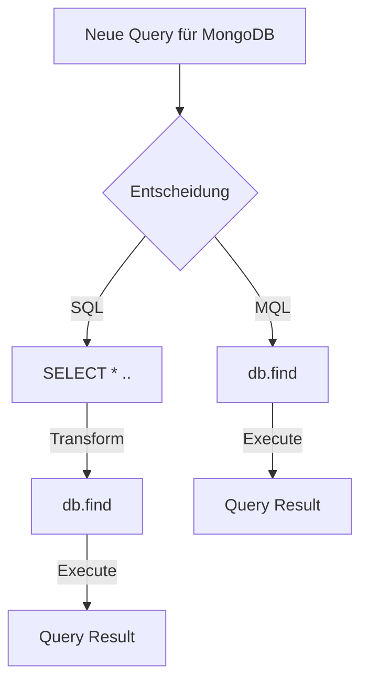

# MongoDB Indizes <br> Sneak Preview

Intro zu MongoDB Indizes und Compass

---
layout: quote
author: "Wikipedia: Sneak Preview"
link: https://de.wikipedia.org/wiki/Sneak_Preview
---

Eine **Sneak Preview** oder kurz **Sneak** ist eine unangekündigte Filmvorführung (Vorschau) vor dem offiziellen Release [...]. 

<style>
p {
  @apply font-light;
}
</style>
---

# SQL Bias

<div grid="~ cols-2 gap-2">

<v-click>

</v-click>

<flat-color-icons-google v-click class="absolute bottom-43 left-13"/>
<emojione-loudly-crying-face v-click class="absolute bottom-8 left-27"/>
<fluent-document-error-24-regular v-after class="absolute bottom-8 left-20 bg-orange-400"/>


<v-click>

- `MQL`: [MongoDB Query Language MQL](https://www.mongodb.com/basics/examples)

</v-click>

</div>

<style>
    h1 {
    @apply !text-2xl;
  }
</style>

---
class: fade
---

# Plan

<v-clicks>

- Features von MongoDB Compass
- Single Field Indizes
- Compound Indizes
- Covered Queries 💡🚀 <twemoji-magic-wand class="animate-ping"/>
- 🎁 

</v-clicks>

---
class: fade
---
# MongoDB Compass <simple-icons-mongodb/>

<v-clicks >

- GUI für den Zugriff auf MongoDB
- Vollversion frei verfügbar [^1]
- Realtime Performance Tab [^2] <dashicons-performance/>
- CRUD Funktionalität [^3]
- Aggregation Pipeline Builder [^4] 💪

</v-clicks>

[^1]: [MongoDB Compass is now free for all!](https://www.mongodb.com/blog/post/compass-now-free-for-all)
[^2]: [MongoDB Compass Performance Tab](https://docs.mongodb.com/compass/current/performance/)
[^3]: [Capabilities of Compass Editions](https://docs.mongodb.com/compass/current/editions/)
[^4]: [Aggregation Pipeline Builder](https://docs.mongodb.com/compass/current/aggregation-pipeline-builder/)

<style>
  h1 {
    @apply !text-2xl;
  }
  .footnotes-sep {
    @apply mt-40 opacity-10;
  }
  .footnotes {
    @apply text-sm opacity-75;
  }
  .footnote-backref {
    display: none;
  }
</style>
---
image: https://docs.mongodb.com/manual/images/index-for-sort.bakedsvg.svg
---

# Datenbankindex kurz erklärt [^1]


[^1]: [MongoDB - Indexes](https://docs.mongodb.com/manual/indexes/)

<style>
  h1 {
    @apply !text-2xl;
  }
  .footnotes-sep {
    @apply mt-110 opacity-10;
  }
  .footnotes {
    @apply text-sm opacity-75;
  }
  .footnote-backref {
    display: none;
  }
</style>
---

# AirBnB Dataset [^1]

```json {2|3-9|10-14|all}
{
  "_id": "10006546",
  "listing_url": "https://www.airbnb.com/rooms/10006546",
  "name": "Ribeira Charming Duplex",
  "property_type": "House",
  "room_type": "Entire home/apt",
  "bed_type": "Real Bed",
  "minimum_nights": "2",
  "cancellation_policy": "moderate",
  "last_scraped": {
    "$date": {
      "$numberLong": "1550293200000"
    }
  },
  "address": {
    "country": "Portugal",
  }
}
```

[^1]: [Sample AirBnB Listings Dataset - Daten von Inside Airbnb](https://docs.atlas.mongodb.com/sample-data/sample-airbnb/)


<style>
  h1 {
    @apply !text-2xl;
  }
  .footnotes-sep {
    @apply mt-20 opacity-10;
  }
  .footnotes {
    @apply text-sm opacity-75;
  }
  .footnote-backref {
    display: none;
  }
</style>

---
layout: image
image: https://source.unsplash.com/random?coding
---

# Demo 👩‍💻

- <carbon-logo-github /> [demo](https://github.com/Felixel42/mongodb-indexes-sneak-preview/blob/main/demo/README.md)

<style>
  h1 {
    @apply text-shadow-xl;
  }
</style>

---
layout: cover
---

# Danke! 🎄

- <carbon-link /> [Sample AirBnB Listings Dataset - Daten von Inside Airbnb](https://docs.atlas.mongodb.com/sample-data/sample-airbnb/)
- <carbon-logo-github /> [github.com/Felixel42/mongodb-indexes-sneak-preview](https://github.com/Felixel42/mongodb-indexes-sneak-preview)
- <carbon-logo-github /> [Set up database & demo](https://github.com/Felixel42/mongodb-indexes-sneak-preview/blob/main/demo/README.md)
- <carbon-link /> [Erklärvideo zum Verständnis von explain()](https://www.mongodb.com/presentations/tips-and-tricks-for-query-performance-let-us-explain-them) <vscode-icons-file-type-mongo/> 
