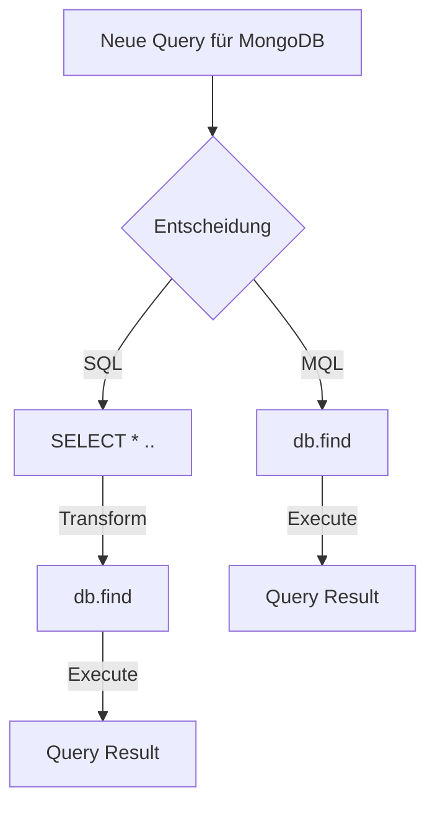

# MongoDB Indizes <br> Sneak Preview

Intro zu MongoDB Indizes und Compass

---
layout: quote
author: "Wikipedia: Sneak Preview"
link: https://de.wikipedia.org/wiki/Sneak_Preview
---

Eine **Sneak Preview** oder kurz **Sneak** ist eine unangekündigte Filmvorführung (Vorschau) vor dem offiziellen Release [...]. Die Besucher wissen beim Kartenkauf nicht, welcher Film gezeigt wird.

---

# SQL Bias

<div grid="~ cols-2 gap-2" m="-t-2">

<v-click>

</v-click>

<v-click>

- `MQL`: [MongoDB Query Language MQL](https://www.mongodb.com/basics/examples)

</v-click>

</div>

<style>
    h1 {
    @apply !text-2xl;
  }
</style>

---

# Plan

<v-clicks>

- Features von MongoDB Compass
- Single Field Indizes
- Compound Indizes
- Covered Queries 💡🚀 
- 🎁 

</v-clicks>

---

# AirBnB Anzeigen Beispiel Dataset [^1]

```json {2|3-9|10-14|all}
{
  "_id": "10006546",
  "listing_url": "https://www.airbnb.com/rooms/10006546",
  "name": "Ribeira Charming Duplex",
  "property_type": "House",
  "room_type": "Entire home/apt",
  "bed_type": "Real Bed",
  "minimum_nights": "2",
  "cancellation_policy": "moderate",
  "last_scraped": {
    "$date": {
      "$numberLong": "1550293200000"
    }
  },
  "address": {
    "country": "Portugal",
  }
}
```

[^1]: [Sample AirBnB Listings Dataset - Daten von Inside Airbnb](https://docs.atlas.mongodb.com/sample-data/sample-airbnb/)


<style>
  h1 {
    @apply !text-2xl;
  }
</style>

---
layout: image
image: https://source.unsplash.com/random?coding
---

# Demo 👩‍💻

- <carbon-logo-github /> [demo](https://github.com/Felixel42/mongodb-indexes-sneak-preview/blob/main/demo/README.md)

<style>
  h1 {
    @apply text-shadow-xl;
  }
</style>

---
layout: cover
---

# Danke!

- <carbon-link /> [Sample AirBnB Listings Dataset - Daten von Inside Airbnb](https://docs.atlas.mongodb.com/sample-data/sample-airbnb/)
- <carbon-logo-github /> [github.com/Felixel42/mongodb-indexes-sneak-preview](https://github.com/Felixel42/mongodb-indexes-sneak-preview)
- <carbon-logo-github /> [Set up database & demo](https://github.com/Felixel42/mongodb-indexes-sneak-preview/blob/main/demo/README.md)
- <vscode-icons-file-type-mongo/> <carbon-link /> [Erklärvideo zum Verständnis von explain()](https://www.mongodb.com/presentations/tips-and-tricks-for-query-performance-let-us-explain-them)