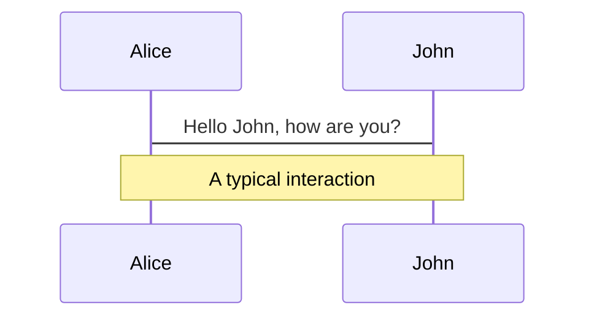
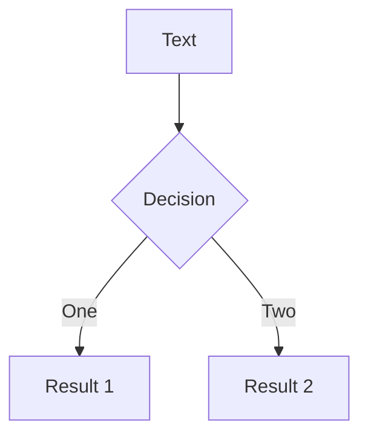
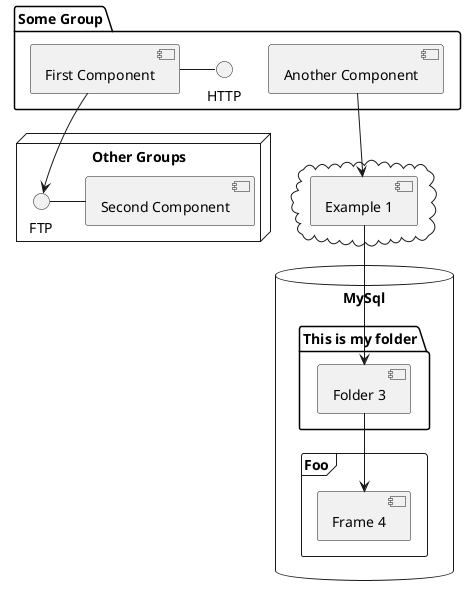

# MongoDB Indizes <br> Sneak Preview

Intro zu MongoDB Indizes und Compass

---
layout: quote
author: "Wikipedia: Sneak Preview"
link: https://de.wikipedia.org/wiki/Sneak_Preview
---

Eine **Sneak Preview** oder kurz **Sneak** ist eine unangekündigte Filmvorführung (Vorschau) vor dem offiziellen Release [...]. Die Besucher wissen beim Kartenkauf nicht, welcher Film gezeigt wird.

---

# Ziele des Vortrags

<v-clicks>

- Features von MongoDB Compass zeigen
- Single Field Indizes
- Compound Indizes
- Covered Queries 💡🚀 
- 🎁 

</v-clicks>

---

# SQL Bias

Slidev is a slides maker and presenter designed for developers, consist of the following features

- 📝 **Text-based** - focus on the content with Markdown, and then style them later 
- 🎨 **Themable** - theme can be shared and used with npm packages
- 🧑‍💻 **Developer Friendly** - code highlighting, live coding with autocompletion
- 🤹 **Interactive** - embedding Vue components to enhance your expressions
- 🎥 **Recording** - built-in recording and camera view
- 📤 **Portable** - export into PDF, PNGs, or even a hostable SPA
- 🛠 **Hackable** - anything possible on a webpage

<br>
<br>

---

# Navigation

Hover on the bottom-left corner to see the navigation's controls panel, [learn more](https://sli.dev/guide/navigation.html)


### Keyboard Shortcuts

|     |     |
| --- | --- |
| <kbd>right</kbd> / <kbd>space</kbd>| next animation or slide |
| <kbd>left</kbd>  / <kbd>shift</kbd><kbd>space</kbd> | previous animation or slide |
| <kbd>up</kbd> | previous slide |
| <kbd>down</kbd> | next slide |

<!-- https://sli.dev/guide/animations.html#click-animations -->

<p v-after class="absolute bottom-23 left-45 opacity-30 transform -rotate-10">Here!</p>


---

# MongoDB Airbnb sample [^1]

```json
{
  "_id": "10006546",
  "listing_url": "https://www.airbnb.com/rooms/10006546",
  "name": "Ribeira Charming Duplex",
  "summary": "Fantastic duplex apartment with three bedrooms, located in the historic area of Porto, Ribeira (Cube)...",
  "interaction": "Cot - 10 € / night Dog - € 7,5 / night",
  "house_rules": "Make the house your home...",
  "property_type": "House",
  "room_type": "Entire home/apt",
  "bed_type": "Real Bed",
  "minimum_nights": "2",
  "maximum_nights": "30",
  "cancellation_policy": "moderate",
  "last_scraped": {
    "$date": {
      "$numberLong": "1550293200000"
    }
  },
  "calendar_last_scraped": {
    "$date": {
      "$numberLong": "1550293200000"
    }
  },
  "first_review": {
    "$date": {
      "$numberLong": "1451797200000"
    }
  },
  "last_review": {
    "$date": {
      "$numberLong": "1547960400000"
    }
  },
  "accommodates": {
    "$numberInt": "8"
  },
  "bedrooms": {
    "$numberInt": "3"
  },
  "beds": {
    "$numberInt": "5"
  },
  "number_of_reviews": {
    "$numberInt": "51"
  },
  "bathrooms": {
    "$numberDecimal": "1.0"
  },
  "amenities": [
    "TV",
    ...
  ],
  "price": {
    "$numberDecimal": "80.00"
  },
  "security_deposit": {
    "$numberDecimal": "200.00"
  },
  "cleaning_fee": {
    "$numberDecimal": "35.00"
  },
  "extra_people": {
    "$numberDecimal": "15.00"
  },
  "guests_included": {
    "$numberDecimal": "6"
  },
  "images": {
    "thumbnail_url": "",
    "medium_url": "",
    "picture_url": "https://a0.muscache.com/im/pictures/e83e702f-ef49-40fb-8fa0-6512d7e26e9b.jpg?aki_policy=large",
    "xl_picture_url": ""
  },
  "host": {
    "host_id": "51399391",
    "host_url": "https://www.airbnb.com/users/show/51399391",
    "host_name": "Ana&Gonçalo",
    "host_location": "Porto, Porto District, Portugal",
    "host_about": "Gostamos de passear, de viajar, de conhecer pessoas e locais novos, gostamos de desporto e animais! Vivemos na cidade mais linda do mundo!!!",
    "host_response_time": "within an hour",
    "host_thumbnail_url": "https://a0.muscache.com/im/pictures/fab79f25-2e10-4f0f-9711-663cb69dc7d8.jpg?aki_policy=profile_small",
    "host_picture_url": "https://a0.muscache.com/im/pictures/fab79f25-2e10-4f0f-9711-663cb69dc7d8.jpg?aki_policy=profile_x_medium",
    "host_neighbourhood": "",
    "host_response_rate": {
      "$numberInt": "100"
    },
    "host_is_superhost": false,
    "host_has_profile_pic": true,
    "host_identity_verified": true,
    "host_listings_count": {
      "$numberInt": "3"
    },
    "host_total_listings_count": {
      "$numberInt": "3"
    },
    "host_verifications": [
      "email",
      "phone",
      "reviews",
      "jumio",
      "offline_government_id",
      "government_id"
    ]
  },
  "address": {
    "street": "Porto, Porto, Portugal",
    "suburb": "",
    "government_area": "Cedofeita, Ildefonso, Sé, Miragaia, Nicolau, Vitória",
    "market": "Porto",
    "country": "Portugal",
    "country_code": "PT",
    "location": {
      "type": "Point",
      "coordinates": [
        {
          "$numberDouble": "-8.61308"
        },
        {
          "$numberDouble": "41.1413"
        }
      ],
      "is_location_exact": false
    }
  },
  "availability": {
    "availability_30": {
      "$numberInt": "28"
    },
    "availability_60": {
      "$numberInt": "47"
    },
    "availability_90": {
      "$numberInt": "74"
    },
    "availability_365": {
      "$numberInt": "239"
    }
  },
  "review_scores": {
    "review_scores_accuracy": {
      "$numberInt": "9"
    },
    "review_scores_cleanliness": {
      "$numberInt": "9"
    },
    "review_scores_checkin": {
      "$numberInt": "10"
    },
    "review_scores_communication": {
      "$numberInt": "10"
    },
    "review_scores_location": {
      "$numberInt": "10"
    },
    "review_scores_value": {
      "$numberInt": "9"
    },
    "review_scores_rating": {
      "$numberInt": "89"
    }
  },
  "reviews": [
    {
      "_id": "362865132",
      "date": {
        "$date": {
          "$numberLong": "1545886800000"
        }
      },
      "listing_id": "10006546",
      "reviewer_id": "208880077",
      "reviewer_name": "Thomas",
      "comments": "Very helpful hosts. Cooked traditional..."
    },
    {
      "_id": "364728730",
      "date": {
        "$date": {
          "$numberLong": "1546232400000"
        }
      },
      "listing_id": "10006546",
      "reviewer_id": "91827533",
      "reviewer_name": "Mr",
      "comments": "Ana & Goncalo were great on communication..."
    },
    {
      "_id": "403055315",
      "date": {
        "$date": {
          "$numberLong": "1547960400000"
        }
      },
      "listing_id": "10006546",
      "reviewer_id": "15138940",
      "reviewer_name": "Milo",
      "comments": "The house was extremely well located..."
    }
  ]
}
```

[^1]: [](https://docs.atlas.mongodb.com/sample-data/sample-airbnb/)

---

# Themes

Slidev comes with powerful theming support. Themes can provide styles, layouts, components, or even configurations for tools. Switching between themes by just **one edit** in your frontmatter:

<div grid="~ cols-2 gap-2" m="-t-2">

```yaml
---
theme: default
---
```

```yaml
---
theme: seriph
---
```


</div>

Read more about [How to use a theme](https://sli.dev/themes/use.html) and
check out the [Awesome Themes Gallery](https://sli.dev/themes/gallery.html).

---
preload: false
---

# Animations

Animations are powered by [@vueuse/motion](https://motion.vueuse.org/).

```html
<div
  v-motion
  :initial="{ x: -80 }"
  :enter="{ x: 0 }">
  Slidev
</div>
```

<div class="w-60 relative mt-6">
  <div class="relative w-40 h-40">
    
    
    
  </div>

  <div
    class="text-5xl absolute top-14 left-40 text-[#2B90B6] -z-1"
    v-motion
    :initial="{ x: -80, opacity: 0}"
    :enter="{ x: 0, opacity: 1, transition: { delay: 2000, duration: 1000 } }">
    Slidev
  </div>
</div>

<!-- vue script setup scripts can be directly used in markdown, and will only affects current page -->
<script setup lang="ts">
const final = {
  x: 0,
  y: 0,
  rotate: 0,
  scale: 1,
  transition: {
    type: 'spring',
    damping: 10,
    stiffness: 20,
    mass: 2
  }
}
</script>

<div
  v-motion
  :initial="{ x:35, y: 40, opacity: 0}"
  :enter="{ y: 0, opacity: 1, transition: { delay: 3500 } }">

[Learn More](https://sli.dev/guide/animations.html#motion)

</div>

---

# Diagrams

You can create diagrams / graphs from textual descriptions, directly in your Markdown.

<div class="grid grid-cols-3 gap-10 pt-4 -mb-6">







</div>

[Learn More](https://sli.dev/guide/syntax.html#diagrams)


---
layout: center
class: text-center
---

# Learn More

[Documentations](https://sli.dev) · [GitHub](https://github.com/slidevjs/slidev) · [Showcases](https://sli.dev/showcases.html)
