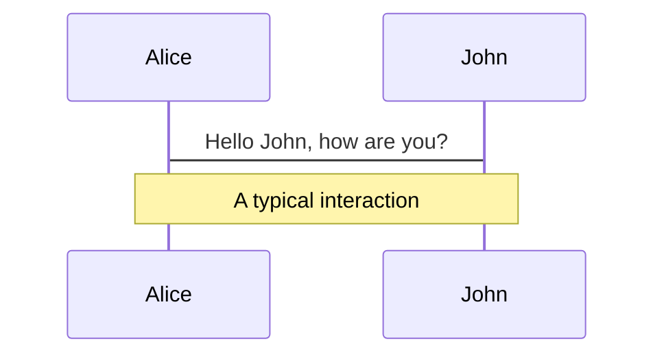
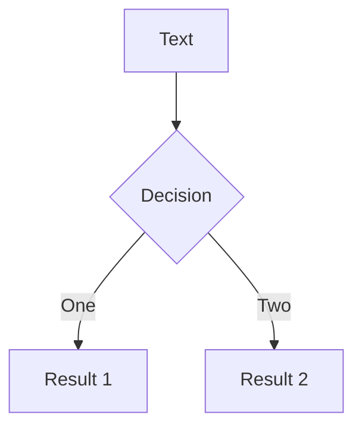
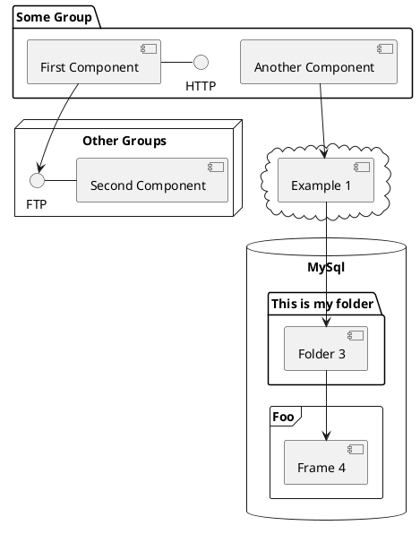

# MongoDB Indizes <br> Sneak Preview

Intro zu MongoDB Indizes und Compass

---
layout: quote
author: "Wikipedia: Sneak Preview"
link: https://de.wikipedia.org/wiki/Sneak_Preview
---

Eine **Sneak Preview** oder kurz **Sneak** ist eine unangekündigte Filmvorführung (Vorschau) vor dem offiziellen Release [...]. Die Besucher wissen beim Kartenkauf nicht, welcher Film gezeigt wird.

---

# Inhalt

<v-clicks>

- Features von MongoDB Compass
- Single Field Indizes
- Compound Indizes
- Covered Queries 💡🚀 
- 🎁 

</v-clicks>

---

# SQL Bias

Slidev is a slides maker and presenter designed for developers, consist of the following features

- 📝 **Text-based** - focus on the content with Markdown, and then style them later 
- 🎨 **Themable** - theme can be shared and used with npm packages
- 🧑‍💻 **Developer Friendly** - code highlighting, live coding with autocompletion
- 🤹 **Interactive** - embedding Vue components to enhance your expressions
- 🎥 **Recording** - built-in recording and camera view
- 📤 **Portable** - export into PDF, PNGs, or even a hostable SPA
- 🛠 **Hackable** - anything possible on a webpage


---

# Navigation

Hover on the bottom-left corner to see the navigation's controls panel, [learn more](https://sli.dev/guide/navigation.html)


### Keyboard Shortcuts

|     |     |
| --- | --- |
| <kbd>right</kbd> / <kbd>space</kbd>| next animation or slide |
| <kbd>left</kbd>  / <kbd>shift</kbd><kbd>space</kbd> | previous animation or slide |
| <kbd>up</kbd> | previous slide |
| <kbd>down</kbd> | next slide |

<!-- https://sli.dev/guide/animations.html#click-animations -->

<p v-after class="absolute bottom-23 left-45 opacity-30 transform -rotate-10">Here!</p>


---

# AirBnB Anzeigen Beispiel Dataset [^1]

```json {2|3-9|10-14|all}
{
  "_id": "10006546",
  "listing_url": "https://www.airbnb.com/rooms/10006546",
  "name": "Ribeira Charming Duplex",
  "property_type": "House",
  "room_type": "Entire home/apt",
  "bed_type": "Real Bed",
  "minimum_nights": "2",
  "cancellation_policy": "moderate",
  "last_scraped": {
    "$date": {
      "$numberLong": "1550293200000"
    }
  },
  "address": {
    "country": "Portugal",
  }
}
```

[^1]: [Sample AirBnB Listings Dataset - Daten von Inside Airbnb](https://docs.atlas.mongodb.com/sample-data/sample-airbnb/)


<style>
  h1 {
    @apply !text-2xl;
  }
</style>

---

# Themes

Slidev comes with powerful theming support. Themes can provide styles, layouts, components, or even configurations for tools. Switching between themes by just **one edit** in your frontmatter:

<div grid="~ cols-2 gap-2" m="-t-2">

```yaml
---
theme: default
---
```

```yaml
---
theme: seriph
---
```


</div>

Read more about [How to use a theme](https://sli.dev/themes/use.html) and
check out the [Awesome Themes Gallery](https://sli.dev/themes/gallery.html).

---
preload: false
---

# Animations

Animations are powered by [@vueuse/motion](https://motion.vueuse.org/).

```html
<div
  v-motion
  :initial="{ x: -80 }"
  :enter="{ x: 0 }">
  Slidev
</div>
```

<div class="w-60 relative mt-6">
  <div class="relative w-40 h-40">
    
    
    
  </div>

  <div
    class="text-5xl absolute top-14 left-40 text-[#2B90B6] -z-1"
    v-motion
    :initial="{ x: -80, opacity: 0}"
    :enter="{ x: 0, opacity: 1, transition: { delay: 2000, duration: 1000 } }">
    Slidev
  </div>
</div>

<!-- vue script setup scripts can be directly used in markdown, and will only affects current page -->
<script setup lang="ts">
const final = {
  x: 0,
  y: 0,
  rotate: 0,
  scale: 1,
  transition: {
    type: 'spring',
    damping: 10,
    stiffness: 20,
    mass: 2
  }
}
</script>

<div
  v-motion
  :initial="{ x:35, y: 40, opacity: 0}"
  :enter="{ y: 0, opacity: 1, transition: { delay: 3500 } }">

[Learn More](https://sli.dev/guide/animations.html#motion)

</div>

---

# Diagrams

You can create diagrams / graphs from textual descriptions, directly in your Markdown.

<div class="grid grid-cols-3 gap-10 pt-4 -mb-6">







</div>

[Learn More](https://sli.dev/guide/syntax.html#diagrams)


---
layout: cover
---

# 🙇 Danke! 🙇

- <carbon-link /> [sli.dev](https://sli.dev)
- <carbon-logo-github /> [github.com/Felixel42/mongodb-indexes-sneak-preview](https://github.com/Felixel42/mongodb-indexes-sneak-preview)
- <carbon-logo-github /> [Set up Database & demo](https://github.com/enolive/intro-to-slidev)
- <vscode-icons-file-type-mongo/> <carbon-link /> [Erklärvideo zum Verstehen von explain()](https://www.mongodb.com/presentations/tips-and-tricks-for-query-performance-let-us-explain-them)